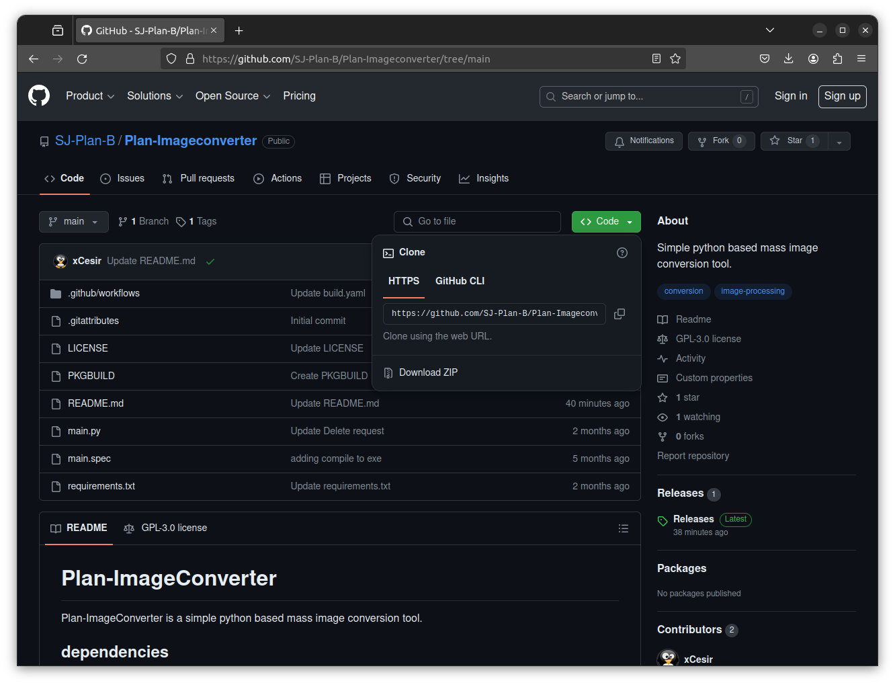
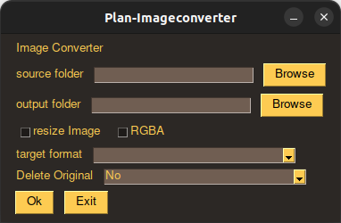
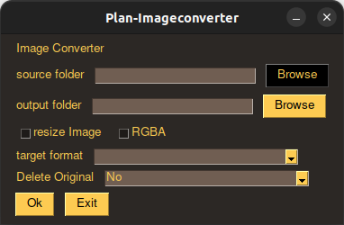
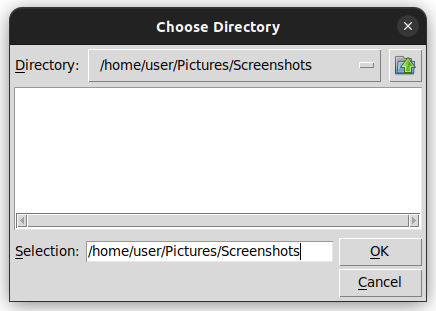
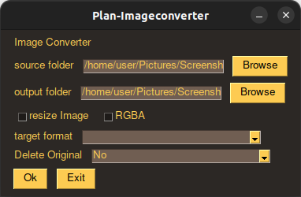
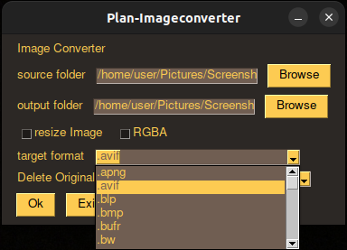
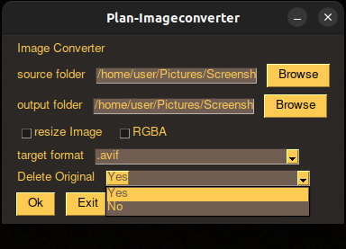
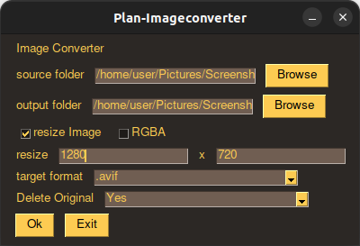
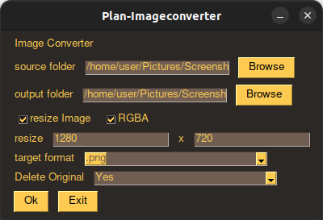
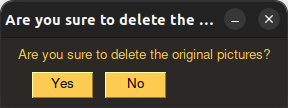

# Plan-ImageConverter
Plan-ImageConverter is a simple python based mass image conversion tool.

## dependencies
You must install the following dependencies
```
pip3 install pillow==10.3.0
pip3 install pillow-avif-plugin==1.4.2
pip3 install PySimpleGUI==4.60.5
```
or
```
pip install -r requirements.txt
```
### Linux
On Linux, an additional requirement is `python3-tk`

Ubuntu:

```
sudo apt install python3-tk
```

## Usage
1.  Installation / Download
      1.  Download the Repository:
            1. Click on "<> Code", then
            2. Download ZIP.
            3. 
            4. Unpack the Zip
            5. Open the unpacked folder.
            6. Right click inside the folder.
            7. Open in Terminal
            8. `pip install -r requirements.txt`
            9. Run `main.py` by entering `python ./main.py` into the console
      2. ... or [Download](https://github.com/SJ-Plan-B/Plan-Imageconverter/releases/tag/Releases) the .exe and run it
      3. 
3.  Select the `source folder` where the pictures are which to convert
      1. Either enter or paste the path into the field,
      2. or use the Browse Button
      3. 
      4. 
      5. Note: this window may look different depending on the Operating System you're running (e.g. Windows or Ubuntu)
5.  Select the `ouput folder` where to paste the pictures.
      1. Either enter or paste the path into the field,
      2. or use the Browse Button
      3. 
      4. 
      5. Note: this window may look different depending on the Operating System you're running (e.g. Windows or Ubuntu)
      *  Note that the `source folder` and `ouput folder` may be the same. <br> The initial idea is to select a different and `output folder` and maintain the folder structure.<br>
    ```
      ├── source folder
      ├── folder 1
      │   ├── picture1.png
      │   ├── picture2.png
      │   ├── picture3.png
      │   ├── picture4.png
      │   └── picture5.png
      └── folder 2
          ├── picture6.png
          ├── picture7.png
          ├── picture8.png
          ├── picture9.png
          └── picture0.png
      ```
      ```
      ├── target folder
      ├── folder 1
      │   ├── picture1.jpg
      │   ├── picture2.jpg
      │   ├── picture3.jpg
      │   ├── picture4.jpg
      │   └── picture5.jpg
      └── folder 2
          ├── picture6.jpg
          ├── picture7.jpg
          ├── picture8.jpg
          ├── picture9.jpg
          └── picture0.jpg
      ```
      If the `source folder` and `target folder` are the same:   
      ```
      ├── source folder / target folder
      ├── folder 1
      │   ├── picture1.jpg
      │   ├── picture2.jpg
      │   ├── picture3.jpg
      │   ├── picture4.jpg
      │   ├── picture5.jpg
      │   ├── picture1.png
      │   ├── picture2.png
      │   ├── picture3.png
      │   ├── picture4.png
      │   └── picture5.png
      └── folder 2
          ├── picture6.jpg
          ├── picture7.jpg
          ├── picture8.jpg
          ├── picture9.jpg
          ├── picture0.jpg
          ├── picture6.png
          ├── picture7.png
          ├── picture8.png
          ├── picture9.png
          └── picture0.png
      ```
      Additionally, there is an option to delete the original files:

      ```
      ├── source folder / target folder
      ├── folder 1
      │   ├── picture1.jpg
      │   ├── picture2.jpg
      │   ├── picture3.jpg
      │   ├── picture4.jpg
      │   └── picture5.jpg
      └── folder 2
          ├── picture6.jpg
          ├── picture7.jpg
          ├── picture8.jpg
          ├── picture9.jpg
          └── picture0.jpg
      ```
      * 
7.  Select your target format (e.g .avif or .jpg)
      * 
9.  Choose if to delete the original files or not
      * 
11. (optional) click on `resize Image` and enter a target size (e.g. 1280 x 720)
      * 
13. (optional) enable RGBA when working with [RGBA](https://en.wikipedia.org/wiki/RGBA_color_model) pictures
      * 
15. Press `Ok` to start.
16. When selected to `Delete Original` to Yes. A pop-up will appear to and ask for confirmation.<br>Once you have selected `Yes`, the operation will be performed.<br> `No` will simply change `Delete Original` to `No` and then perform the operation.
      * 

## Supportet formats
'.apng', '.avif', '.blp', '.bmp', '.bufr', '.bw', '.cur', '.dcx', '.dds',
'.dib', '.emf', '.eps', '.fit', '.fits', '.flc', '.fli', '.ftc', '.ftu',
'.gbr', '.grib', '.h5', '.hdf', '.icb', '.icns', '.ico', '.iim', '.im',
'.j2c', '.j2k', '.jfif', '.jp2', '.jpc', '.jpe', '.jpeg', '.jpf', '.jpg',
'.jpx', '.mpeg', '.mpg', '.msp', '.pbm', '.pcd', '.pcx', '.pgm', '.png',
'.pnm', '.ppm', '.ps', '.psd', '.pxr', '.qoi', '.ras', '.rgb', '.rgba',
'.sgi', '.tga', '.tif', '.tiff', '.vda', '.vst', '.webp', '.wmf', '.xbm',
'.xpm'

### Author
Sidney Schmidt
